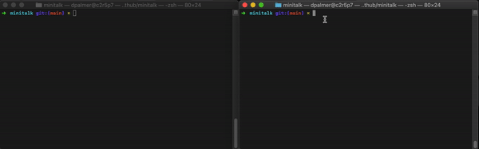

# minitalk


## 🤓 Overview
How do different programs talk to each other? They match on Tinder and then go for coffee.

Alternatively, the grab the Unicode value for any particular character, convert it into binary, and then send a bunch of ones-and-zeros to each other. Believe it or not, that's a super-simplified version of how the internet works. It's also an explanation of this project, where a "client" program sends text to a "server". For the purposes of MiniTalk, this all happens on a single computer, but it is a proof of concept on how to get different programs/machines/super-intelligent AI overlords to speak to communicate.

## 📷 Preview



## 💻 Compilation
To compile:

```make```

Remove the object files:

```make clean```

Remove everything:

```make fclean```
## 🤡 Usage
If that mind-blowing gif was not enough, I'll happily break down how what's going on! After compiling, there should be two (2) executables, "./server" and "./client".

Start the ```./server``` first with no arguments. It will display an ID number that your local computer generates.

Now, fire up that bad-boy client like so:
```./client``` ```[whatever number the server displays]``` and ```add a message **in quotes**.```

Pray to the old gods and the new, and then watch the magic happen.

### 📝 License
Distributed under the MIT License. See [LICENSE](LICENSE) for more information.
